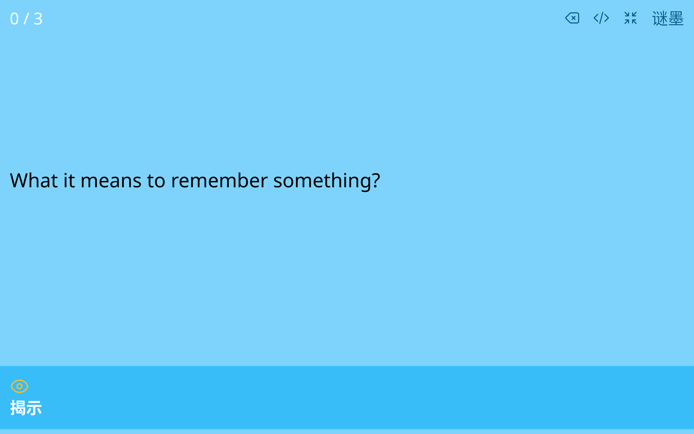

# Mimor Web Component

[ [Playground](https://mimor.xieyuheng.com/playground) ]

A web component for creating flashcard by simple `<question>` & `<answer>` markup.

## Usage

### Install

#### Using CDN

```html
<script src="https://unpkg.com/mimor"></script>
```

#### Using npm

```shell
npm install mimor
```

```js
import 'mimor'
```

### `<x-mimor>` Web Component

A web component call "x-mimor" will be defined:

```html
<x-mimor
  style="height: 36rem; width: 36rem"
  src="https://mimor.xieyuheng.com/contents/example.mimor"
  theme-name="light"
></x-mimor>
```

Use the following `Props` to config the component:

```typescript
type Props = {
  src: string
  text?: string
  langTag?: 'en' | 'zh'
  themeName?: 'dark' | 'light'
}
```

It is ok to use lisp-case naming convention in html:

```html
<x-mimor
  src="https://..."
  text="..."
  lang-tag="en"
  theme-name="light"
></x-mimor>
```

### Examples

[ [Goto The Playground](https://mimor.xieyuheng.com/playground/PG1ldGFkYXRhIHRoZW1lLWNvbG9yPSJibHVlIiAvPgoKPHF1ZXN0aW9uPgogIFdoYXQgaXQgbWVhbnMgdG8gcmVtZW1iZXIgc29tZXRoaW5nPwoKICA8YW5zd2VyPgogICAgVG8gcmVtZW1iZXIgc29tZXRoaW5nIGlzIHRvIGJlIGFibGUgdG8gcmVjYWxsIGl0IGZyb20gbWVtb3J5IHdoZW4gbmVlZGVkLgogIDwvYW5zd2VyPgo8L3F1ZXN0aW9uPgoKPHF1ZXN0aW9uPgogIEhvdyB0byByZW1lbWJlciBzb21ldGhpbmc_CgogIDxhbnN3ZXI-CiAgICBPbmUgd2F5IHRvIHJlbWVtYmVyIHNvbWV0aGluZyBpcyB0byByZWNhbGwgaXQgb2Z0ZW4uCiAgPC9hbnN3ZXI-CjwvcXVlc3Rpb24-Cgo8cXVlc3Rpb24-CiAgSG93IGRvIHlvdSB1c2UgbWltb3IgdG8gbWFrZSBtZW1vcnkgYSBjaG9pY2U_CgogIDxhbnN3ZXI-CiAgICBCeSBtYWtpbmcgbm90ZXMgaW4gZm9ybSBvZiAmbHQ7cXVlc3Rpb24mZ3Q7IGFuZCAmbHQ7YW5zd2VyJmd0OywKICAgIGFuZCB0byByZWNhbGwgdGhlbSB3aGVuZXZlciB3aXNoZWQsCiAgICB0byBoZWxwIG1lIHJlbWVtYmVyIHRoZW0uCiAgPC9hbnN3ZXI-CjwvcXVlc3Rpb24-Cg) ]

```mimor
<metadata theme-color="blue" />

<question>
  What it means to remember something?

  <answer>
    To remember something is to be able to recall it from memory when needed.
  </answer>
</question>

<question>
  How to remember something?

  <answer>
    One way to remember something is to recall it often.
  </answer>
</question>

<question>
  How do you use mimor to make memory a choice?

  <answer>
    By making notes in form of &lt;question&gt; and &lt;answer&gt;,
    and to recall them whenever wished,
    to help me remember them.
  </answer>
</question>
```

[](https://mimor.xieyuheng.com/playground/PG1ldGFkYXRhIHRoZW1lLWNvbG9yPSJibHVlIiAvPgoKPHF1ZXN0aW9uPgogIFdoYXQgaXQgbWVhbnMgdG8gcmVtZW1iZXIgc29tZXRoaW5nPwoKICA8YW5zd2VyPgogICAgVG8gcmVtZW1iZXIgc29tZXRoaW5nIGlzIHRvIGJlIGFibGUgdG8gcmVjYWxsIGl0IGZyb20gbWVtb3J5IHdoZW4gbmVlZGVkLgogIDwvYW5zd2VyPgo8L3F1ZXN0aW9uPgoKPHF1ZXN0aW9uPgogIEhvdyB0byByZW1lbWJlciBzb21ldGhpbmc_CgogIDxhbnN3ZXI-CiAgICBPbmUgd2F5IHRvIHJlbWVtYmVyIHNvbWV0aGluZyBpcyB0byByZWNhbGwgaXQgb2Z0ZW4uCiAgPC9hbnN3ZXI-CjwvcXVlc3Rpb24-Cgo8cXVlc3Rpb24-CiAgSG93IGRvIHlvdSB1c2UgbWltb3IgdG8gbWFrZSBtZW1vcnkgYSBjaG9pY2U_CgogIDxhbnN3ZXI-CiAgICBCeSBtYWtpbmcgbm90ZXMgaW4gZm9ybSBvZiAmbHQ7cXVlc3Rpb24mZ3Q7IGFuZCAmbHQ7YW5zd2VyJmd0OywKICAgIGFuZCB0byByZWNhbGwgdGhlbSB3aGVuZXZlciB3aXNoZWQsCiAgICB0byBoZWxwIG1lIHJlbWVtYmVyIHRoZW0uCiAgPC9hbnN3ZXI-CjwvcXVlc3Rpb24-Cg)

## Development

```sh
npm install     # Install dependencies
npm run dev     # Start the dev server
npm run check   # Type check
npm run build   # Build the lib/ and dist/
npm run format  # Format the code
```

## Contributions

To make a contribution, fork this project and create a pull request.

Please read the [STYLE-GUIDE.md](STYLE-GUIDE.md) before you change the code.

Remember to add yourself to [AUTHORS](AUTHORS).
Your line belongs to you, you can write a little
introduction to yourself but not too long.

## License

[GPLv3](LICENSE)
